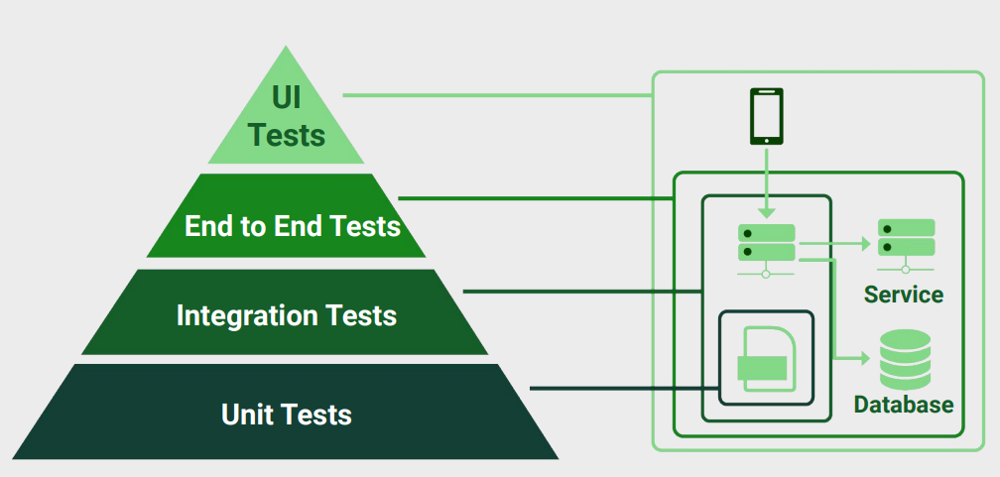

# End-to-End Testing Course for REST APIs with Node.js

## Table of Contents

- [End-to-End Testing](#end-to-end-testing)
- [Installation](#installation)
- [Database Setup](#database-setup)
- [Running Migrations](#running-migrations)
- [Generating Coverage Report](#generating-coverage-report)

## End-to-End Testing

This project uses Jest and Supertest for end-to-end testing of the API. The tests simulate real user interactions with the API and check that it behaves as expected.

To run the end-to-end tests, use the following command:

```sh
npm run test:e2e
```

This will start Jest and run all test files in the e2e directory. Each test file corresponds to a different part of the API.

End-to-end tests are a great way to ensure that your API works as expected and that it continues to work as you make changes to it. They can help you catch bugs early and avoid regressions in your code. 

This kind of testing is essential for any production application, as it helps you try out the services and database connections in a real-world scenario. 



### Tech Stack

| Tech Stack | Badge |
|------------|-------|
| Node.js    | [![NodeJS.org]][NodeJS-url] |
| Express.js | [![ExpressJS.com]][ExpressJS-url] |
| Docker     | [![Docker.com]][Docker-url] |
| PostgreSQL | [![PostgreSQL.com]][PostgreSQL-url] |
| Jest       | [![JestJS.io]][JestJS-url] |
| Supertest  | [![Supertest.io]][Supertest-url] |


### Install the project

To install the project, run the following command:

```sh
npm install
```

After that is necessary to create the .env file with the following content:

```sh
PORT = 3000
DATABASE_URL= postgres://<use>:<pass>@localhost:5432/my_store
API_KEY= 12345
JWT_SECRET='secret123456'
SMTP_EMAIL=your@email.com
SMTP_PASSWORD=password-email
```

### Database Setup

In this case we are using docker to create the postgres database, so you need to have docker installed on your machine.

Then you can connect to the database and create the database with the following command:

```sh
docker-compose exec postgres bash
psql -h localhost -d my_store -U <user>
\d+
SELECT * FROM users;
DELETE FROM users WHERE id=<id>;
```


### Migrations

```sh
npm run migrations:run
```


### How to generate coverage report

```sh
npm run test:coverage
```

Which is the npm task that runs the jest with the --coverage flag. This will generate a coverage folder with the index.html file that you can open in your browser to see the coverage report. The entire task is configured in the package.json file.

The folder name was configured in the jest-e2e.json file, so its name is coverage-e2e.

### License

This project is licensed under the MIT License - see the [LICENSE](LICENSE) file for details.


[NodeJS.org]: https://img.shields.io/badge/Node.js-43853D?style=for-the-badge&logo=node.js&logoColor=white (NodeJS.org)
[NodeJS-url]: https://nodejs.org/es/ (NodeJS.org)

[Docker.com]: https://img.shields.io/badge/Docker-2CA5E0?style=for-the-badge&logo=docker&logoColor=white (Docker.com)
[Docker-url]: https://www.docker.com/ (Docker.com)


[ExpressJS.com]: https://img.shields.io/badge/Express.js-404D59?style=for-the-badge (ExpressJS.com)
[ExpressJS-url]: https://expressjs.com/ (ExpressJS.com)

[PostgreSQL.com]: https://img.shields.io/badge/PostgreSQL-316192?style=for-the-badge&logo=postgresql&logoColor=white (PostgreSQL.com)
[PostgreSQL-url]: https://www.postgresql.org/ (PostgreSQL.com)

[JestJS.io]: https://img.shields.io/badge/Jest-C21325?style=for-the-badge&logo=jest&logoColor=white (JestJS.io)
[JestJS-url]: https://jestjs.io/ (JestJS.io)

[Supertest.io]: https://img.shields.io/badge/Supertest-414141?style=for-the-badge (Supertest.io)
[Supertest-url]: https://www.npmjs.com/package/supertest (Supertest.io)


